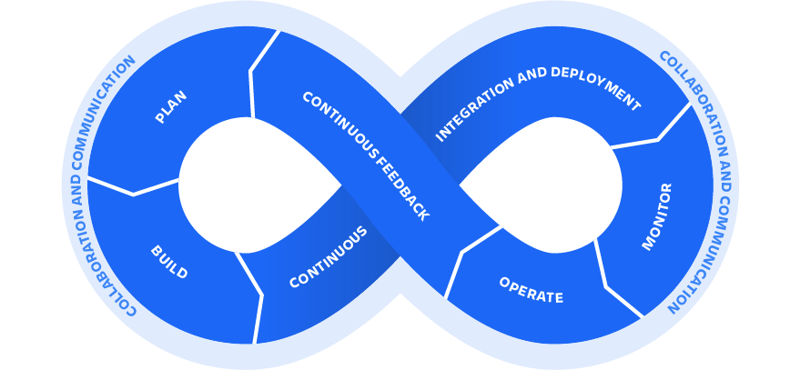

# MIP39c2: Adding TechOps Core Unit

## Preamble

```
MIP39c2-SP#: #21
Author(s): Simon KP
Contributors:
Status:
Date Applied: <yyyy-mm-dd>
Date Ratified: <yyyy-mm-dd>
```

## Sentence Summary

MIP39c2-SP21 adds TechOps Core Unit to handle System Adminstration and Technical Support needs of Maker Protocol and its Core Units.

## Paragraph Summary

TechOps Core Unit will handle System Adminstration and Technical Support needs of Maker Protocol and its Core Units. Striving to improve communication and collaboration between the developers, end users and other stakeholders by applying DevOps principles to software delivery and first class technical support. Getting things done safer and faster in an automated and repeatable way with the help from some of the modern Infrastructure Administration tools. While continuously monitoring and improving the process throughout.

## Specification

### Motivation

TechOps Core Unit (TO CU) is passionately supporting secure, reliable and transparent infrastructure in order to continue and improve Maker DAO’s collaboration, agility and resilience. Stakeholders in the Maker Ecosystem, such as existing CUs and new participants, know that they can rely on an experienced TO CU to set up and securely maintain their infrastructure.

### Mission

Provide technical support services to MakerDAO Ecosystem stakeholders and liaison with external service providers; while ensuring the effectiveness, reliability and security of the MakerDAO infrastructure layer.

### Vision

TO CU is a team of passionate professionals with quality first attitude, extensive experience in the Maker Ecosystem and a heavy interest in the always developing Web3 space.

The infrastructure we deliver is reinforced by:

- *Reliability* - Secure and reliable operations, resulting in high service availability, robust monitoring and regular safe deployments
- *Support* - 24/7 detection and incident response with high level of redundancy between critical components and the team members
- *Transparency* - Accessibility and transparency to other CUs and the DAO community. With the stakeholders mentioned above, regularly informed about the state of the infrastructure, its cost structure and the tradeoffs involved

TO CU closely collaborates with the stakeholders of the Maker Ecosystem, facilitating:

- *Education* - TO CU properly educates other CUs about operational security best practices and regularly reviews them for improvements
- *Point of contact* - TO CU facilitates incident response and acts as a first line of support for external security researchers and Maker Ecosystem participants
- *Integration* - New participants in Maker Ecosystem and 3rd party integrators can access and reuse infrastructure scripts and recipes from the service catalogue created and maintained by TO CU

### Core Unit Name

TechOps Core Unit

### Proposed Core Unit Facilitator(s)

Simon KP (@eskp) and George Niculae (@dizzy)

### Core Unit Team

#### Core Unit Facilitator(s) - 2

TODO Mention LLC(s) here when sorted out

- Communications with Governance and Community
- Agile workload management
- Managing budget and strategy
- 24 hour availability due to time zones coverage
- No single point of failure

#### Engineering - currently 5

So far we have total time zone coverage with Engineers in USA, x3 EU and APAC.

Will be looking to hire another 2 Engineers in the near future to cover more time zones. Namely USA and APAC.

#### Account manager / project manager

Will be looking to hire in the near future. The main objective is to relieve the Facilitators to focus more on Engineering tasks and communications with the community.

### Core Unit Mandate (Responsibilities)

The main areas of responsibilities are:

- Hosting and supporting Critical Maker Components
- General System Administration
- DevOps Services to deliver services reliably
- Research and Development to future proof the infrastructure we manage

*Note:* Due to the limited number of FTE resources and costly cloud infrastructure (see Budget) it is up to the TechOps Core Unit to triage incoming requests and in some cases declaring work as out of scope and infrastructure not critical.
Basically TOCU will not use DAO funds lightly to support trivial infrastructure.

#### Critical Maker Components

- Infrastructure hosting

  - *Protocol Engineering CU* for Eth nodes provisioning, administration and monitoring
  - *Oracle CU* for Administration, Monitoring and new Collateral onboarding
  - *DUX CU* - hosting of the Governance portal
  - Critical Maker protocol components such as:
    - Auctions portal
    - Forum
    - Website TODO Sort out who is responsible - not TOCU
    - Blog
    - Discord administration
    - Various *keepers* - open source services to facilitate Maker smart contracts operations
      - [ETH Filler](https://github.com/makerdao/eth-filler)
      - [Poker Keeper](https://github.com/makerdao/poker-keeper)
      - [Chief Keeper](https://github.com/makerdao/chief-keeper)
      - [Chief Keeper](https://github.com/makerdao/chief-keeper)
      - [Cage Keeper](https://github.com/makerdao/cage-keeper)
      - [Drip Keeper](https://github.com/makerdao/drip-keeper)

- Infrastructure Monitoring & Alerts

  - Dashboards, response to alerts and Reports

  *Note*: TOCU is not responsible for any actions taken from looking at the metrics presented through the dashboards hosted by TOCU. All the data is public and available to be consumed by everyone.

- Development & QA

  - Infrastructure design, CI/CD pipelines, staging environments

- Technical Support

  - Support CUs we work with, to set up accounts, helping with infrastructure setup and configuration, security best practices education, and so on
  - 24/7 follow the sun support, assessment and remediation

- Tools administration

  - 3rd party services administration and management eg. Discord, Grafana, PagerDuty

#### General System Administration

- Infrastructure hosting for the CUs that we work with

- Documentation of critical components

- Cloud providers management

  - Multiple cloud providers to prevent lock-in, add pricing options and introduce fault tolerance. Automated with Infrastructure as Code.

- Network & Security

  - VPC and Firewall management

- Load balancing

  - Dynamic upstreams/certificates automation

- Testing (services and infrastructure)

- Database administration

- Secrets and service credentials management

- Backups & Restore

  - Database
  - Stateful services filesystem
  - Regular automated restore tests of the backups


#### DevOps Services

- Infrastructure as Code Automation

  * Cloud Environment provisioning
  * Cost management & Optimizations

- Source control and artifacts management

  * Github and Docker repositories

- CI/CD - Setting up automated delivery and testing pipelines to deploy Maker services to various environments with confidence

  * Github Actions and other CI systems

- Monitoring, Metrics & Alerts

  * Various server metrics
  * Service availability and performance

- Log Aggregation

  - Centralize log data storage for easy developer access, analysis and optional alerting

- Knowledge Sharing and Training

  * Expected to be continuously learning
  * Provide environment for safe experimentation
  * Regular knowledge sharing presentations within the team and to outside stakeholders

#### Roadmap and R&D/POC

- Eth2 node administration
- Container orchestration on Kubernetes
- Chaos Engineering implementation. Explain a little. Testing of redundancy
- Mapping and establishing SLIs and SLOs (SLOs are a tool to help determine what engineering work to prioritize. Striking the right balance between investing in functionality that will win new customers or retain current ones, versus investing in the reliability and scalability that will keep those customers happy.)

### Challenges

- Implementing secure self-service infrastructure
- Incoming vs Project Work Prioritization
- Team knowledge sharing and keeping up to date
- Collaboration and communication with stakeholders

### Strategy for dealing with the Challenges

By following the rapid continuous improvement and innovation cycle between TechOps and other CUs we strive to improve communication and collaboration between the developers, end users and other stakeholders (that is all participants in MakerDAO ecosystem, not just technical Core Units) by applying DevOps and SRE (Site Reliability Engineering) principles.

<br />


Source: atlassian.com

#### Plan

- Establish clear priorities
  - Ensure that urgent or time sensitive work is prioritized appropriately

- Conduct peer code reviews
  - Minimum of 2 other engineers looking at every code change

- Limit WiP
  - Minimize context switching and improve quality of work

- Knowledge sharing sessions
  - Analyze our performance and update the process as necessary

#### Provision Infrastructure with Infrastructure as Code

- Easy to understand and share with others
- Simple and fast to change, upgrade and scale
- Fast feedback from problems

#### Service Building & Continuous Delivery

We work closely with the developers (and other CUs) to provide them with service delivery pipelines for their service’s code repositories. This allows them to get their work done in smaller batches and automatically deploy new changes, leading to higher quality software and faster feedback from tests and the user.

#### Monitoring Applications, Protocol & Infrastructure

Providing monitoring components such as:
- Performance monitoring
- Insight into system components
- Metrics, Logs and Dashboards
- Alerting infrastructure

#### Continuous Feedback & Transparency

- From the Community
  - Regular meetings for a chance to hear from the stakeholders with any feedback

- Metrics & Logs
  - Monitoring systems setup to gather a constant stream of data to improve our positioning for a more reliable infrastructure
