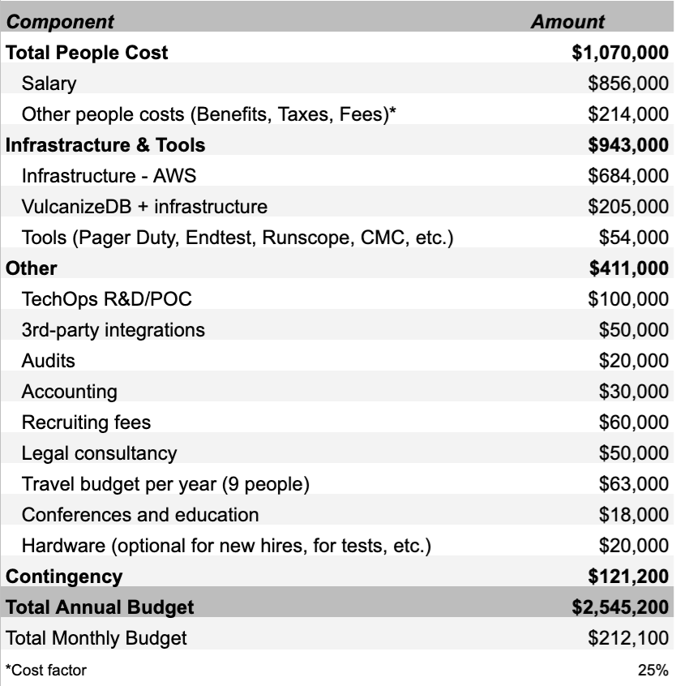
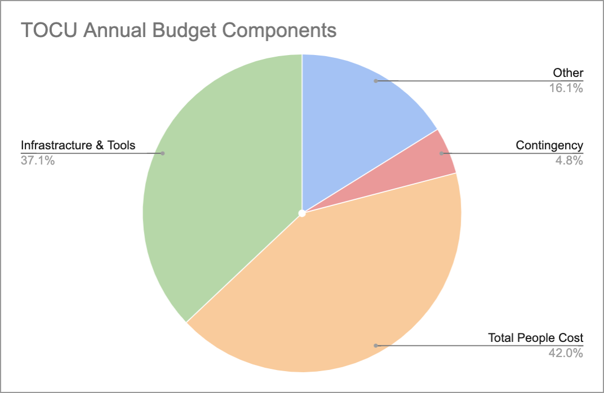

# MIP40c3: Modify TechOps Core Unit Budget

## Preamble
```
MIP40c3-SP#: # TODO
Author(s): Simon KP
Contributors: N/A
Status:
Date Applied: <yyyy-mm-dd>
Date Ratified: <yyyy-mm-dd>
```

## Sentence Summary

The TechOps Core Unit is requesting an annual budget of just over 2.5M DAI.

## Specification
### Core Unit Name

TechOps Core Unit

### Motivation

To continue supporting critical MakerDAO infrastructure TechOps Core Unit proposes the following budget to financially support in delivering on our mandate outlined in the MIP39c2 Adding TO CU.

### Budget

The yearly budget request for the TechOps Core Unit is 2,545,200 DAI. This equates to 212,100 DAI monthly expense to support the team mandate.

This budget secures a team of 5.7 full-time employees as well as covers all operational costs listed in the table below.

At the end of the calendar year, all unused funds will be returned to the Maker Protocol. Should the TechOps Core Unit shutdown, all unused funds will be returned to the DAO immediately.

<br />


<br />


### Budget Details
#### Total People Cost
The total people cost includes salary and other people costs such as benefits, including healthcare and any taxes and fees. As a contingency this has been scaled by 25% to help with any unknown costs involved in dealing with multiple jurisdictions world wide.
#### Salaries
The current team has 5 FTE engineers, including 1 Team Lead, Facilitator(s) and Operations Consultant. The team will be looking to grow with 2 more engineers and an Assistant Account Manager.
#### Infrastructure & Tools
The second biggest cost after people is the Cloud infrastructure we host and provision. 


*Note:* TOCU has to make the final call whether there are enough resources and budget to host any new infrastructure. Critical Maker infrastructure is our number one priority and the budget has been made to reflect that.
##### VulcanizeDB

- VulcanizeDB components
  - During ES gets a list of Vaults
  - Forum badges
  - A couple more

#### TechOps R&D/POC

#### 3rd party integrations
We work with a number of projects such as OpenZeppelin, Forta and Gelato to help integrate Maker into their tools to further support the protocol's daily operational tasks such as running Keepers. All the solutions will be open source and made available to Maker community.
#### Audits

#### Accounting
To help TOCU with the cash flow accounting, annual reports such as company financial's overview and invoicing will be seeking advice from a 3rd party accounting firm or another Core Unit.
#### Recruiting fees
We are planning to grow the team by 2 engineers and 1 account manager in 2022. Recruiting fees are known to be rather high in the industry due to high demand of quality talent. TOCU will keep the bar high for only the best new team members therefore recruiters are going to be critical finding that talent.
#### Legal consultancy
Covering legal opinion consultation including contract drawing, liabilities and any insurance.
#### Travel
Covers flights, lodging, food and any team activities during a conference or an education course.
#### Conferences and Education
In our fast moving industry it becomes absolutely paramount to keep up to date with new technologies and various implementations done by others. Conferences are a fantastic way to meet like minded engineers in the space and also an opportunity present own work to an audience. Education can either be face to face or an online course in a subject that an engineer finds relevant to MakerDAO infrastructure.
#### Hardware
The TechOps Core Unit engineers may need to conduct various tests locally that can't be deployed to our Cloud infrastructure. This can include but not limited to Ethereum nodes that require specific hardware components or application building and testing hardware.
#### Contingency
The contingency represents just under 5% of the total budget and is there to act as a safety buffer against any unknown or unexpected costs.

### Budget Distribution
The budget is to be distributed on a monthly basis to the TechOps Core Unit Multisig, which is an instance of a Gnosis Safe multisig.
The multisig has 2 signers (see below) with a quorum of 2 and Maker protocol remaining the beneficiary. This ensures that no rogue member is able to control the funds and any disputes are resolved by Governance.

*Note*: Maker Protocol retains full administrative control of the funds in the TechOps Core Unit Multisig.

#### Details

TechOps Core Unit Multisig - 0x...
Designated Contact: Simon KP
Quorum - 2
Signers: 2
Simon
Dumitru

TODO Multisig info when ready
Address:


TODO Confirm
This multisig conforms to the requirement ratified by Maker Governance in [MIP47](https://mips.makerdao.com/mips/details/MIP47).

### MKR Vesting

TODO